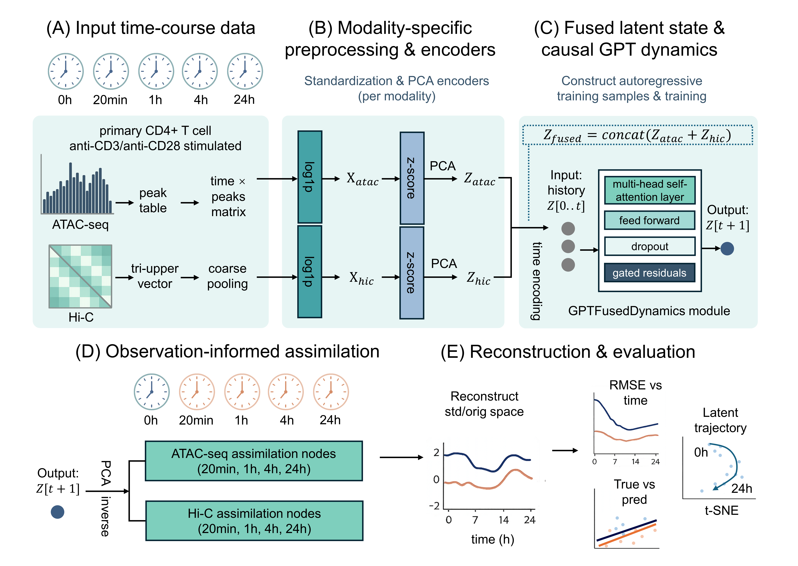

# DyTAC
DyTAC: A Digital Twin Framework for Modeling Chromatin Accessibility and 3D Genome Dynamics during T-cell Activation

<p align="center"></p>

## Environment
- Python == 3.10.13
- Pytorch ==2.4.1

## Training
ATAC-only:
```shell
python train.py --config configs/default.json
```
Fused (ATAC + Hi-C):
```shell
python train_fused.py --config configs/default_modality.json
```

## Prediction & Evaluation
ATAC-only:
```shell
python predict.py --config configs/default.json
```
Fused (ATAC + Hi-C):
```shell
python predict_fused.py --config configs/default_modality.json
```

## Raw data
|Data|resource|
|:---:|:---:|
|stimulated raw data|[GEO Series accession](https://www.ncbi.nlm.nih.gov/geo/query/acc.cgi?acc=GSE138767)|

## HyTAC UI
```shell
pip install streamlit plotly
streamlit run app/app.py
```